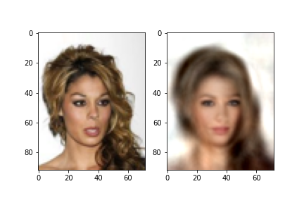
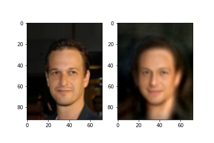
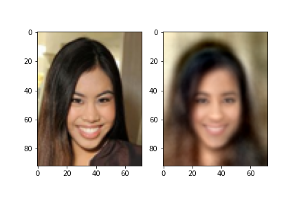
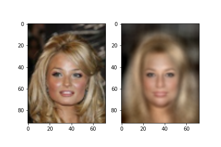
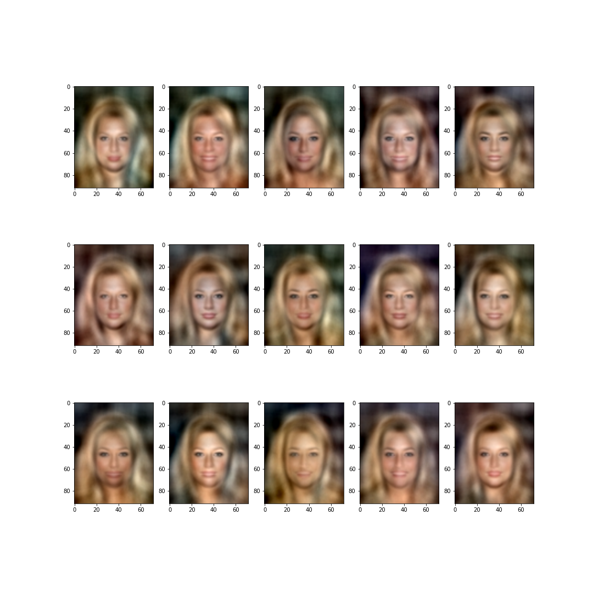
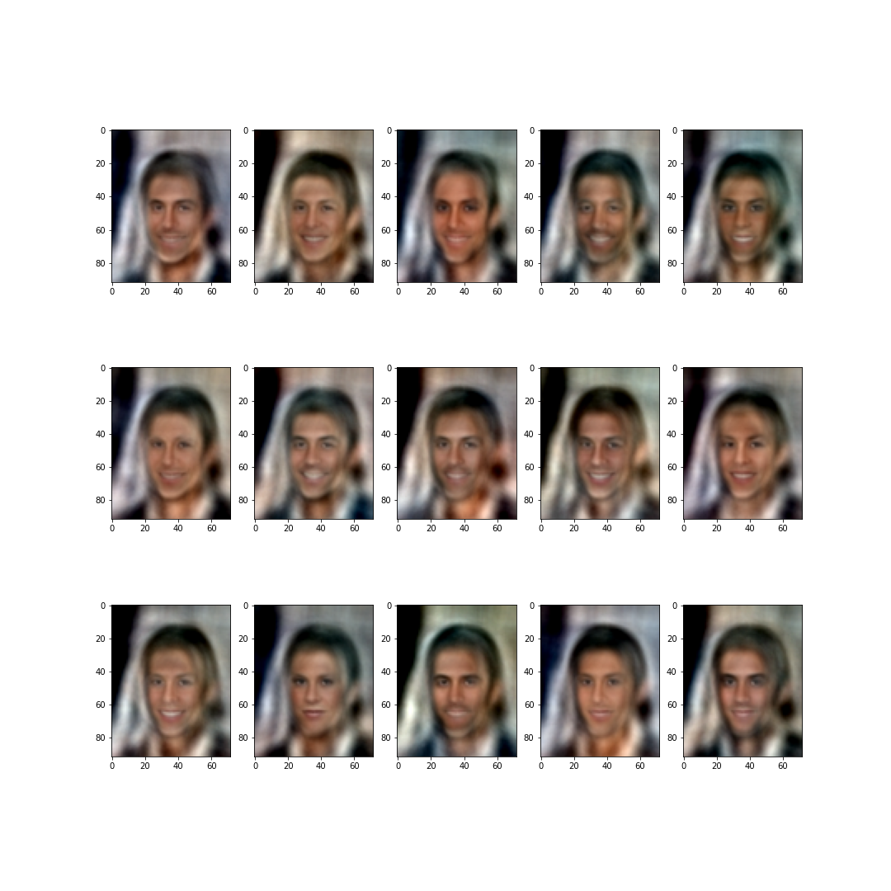
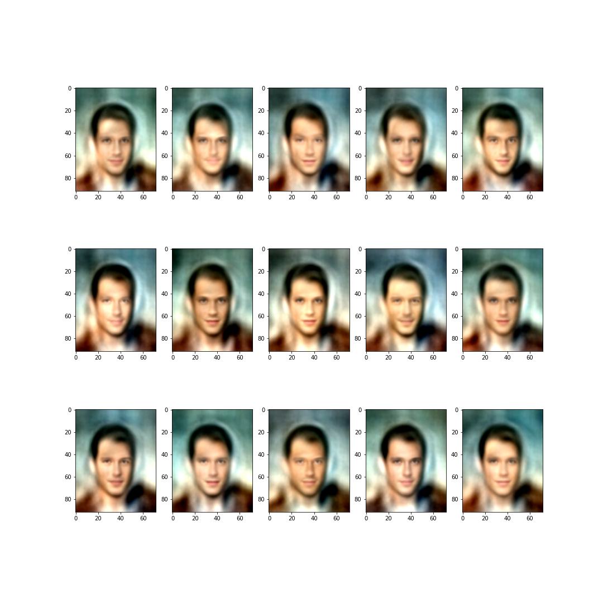
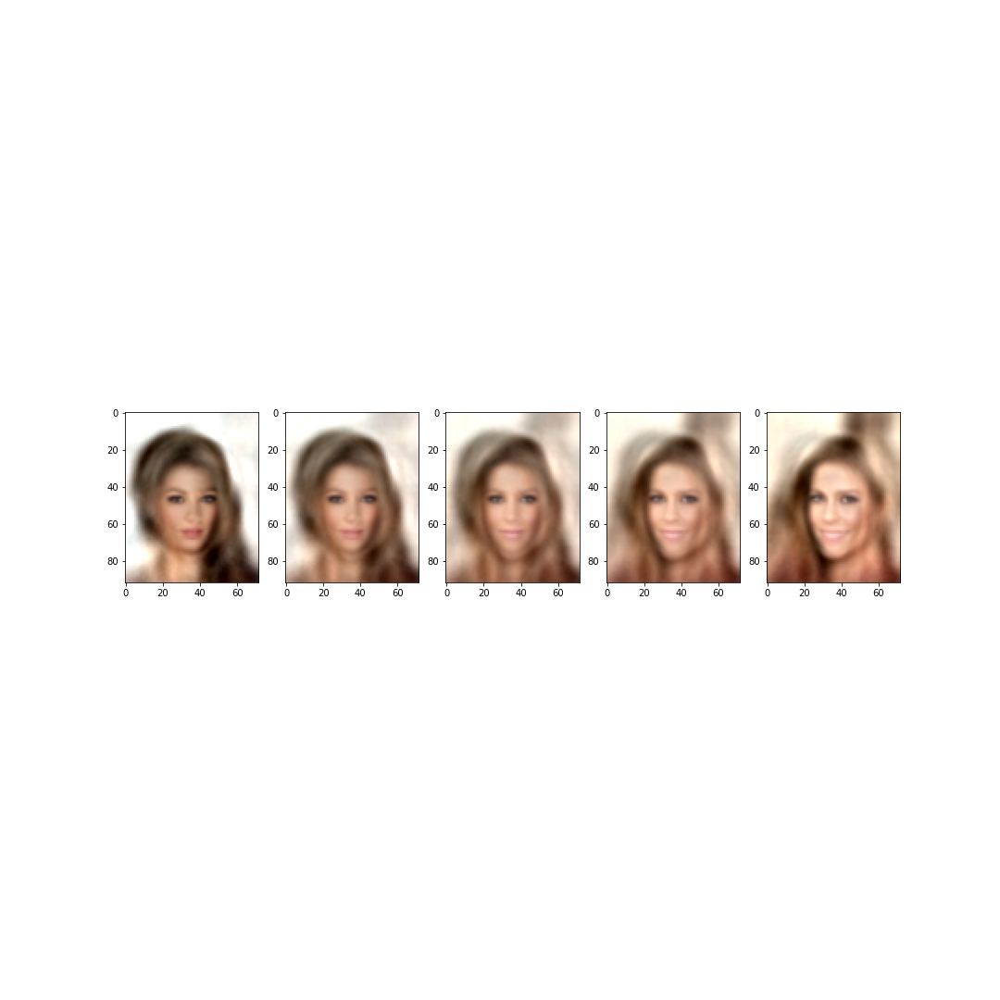
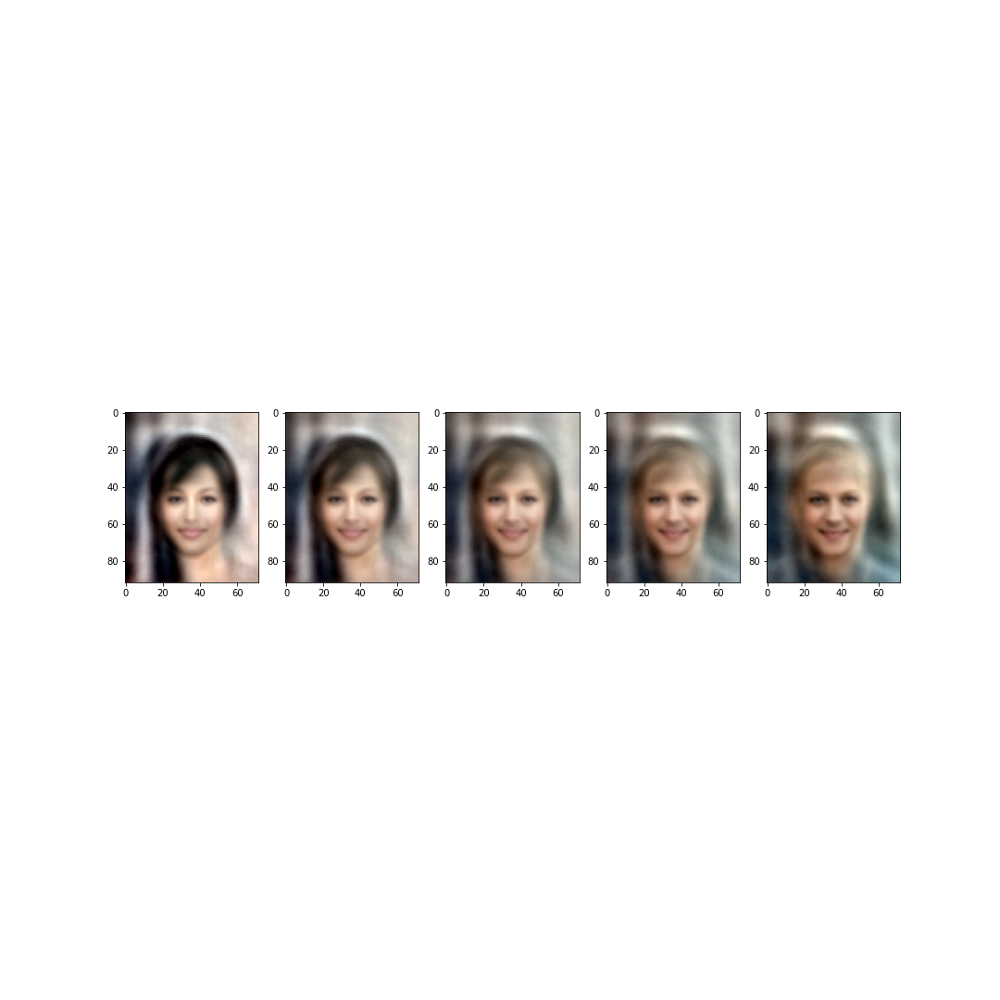
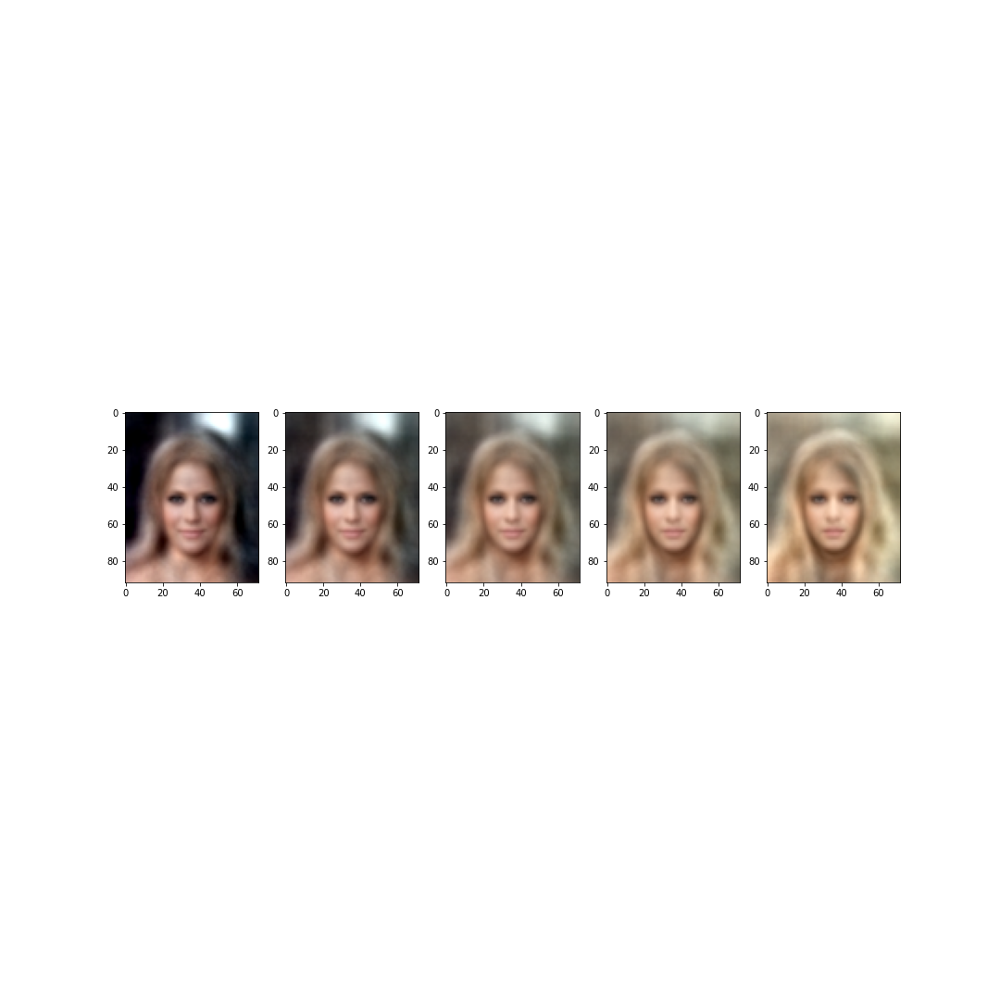

# Face project

Neural images manipulations on the CelebA dataset.

# Play with decoder
An autoencoder model has been trained to reconstruct faces images, using the "train.py" script.
In this notebook, the decoder model has been used to generate new images, based on those from the dataset.
## Image reconstruction
Firstly, the model simply displays the ouput for a simple dataset input. It permite to evaluate the model overall's performance. Here are a few exemples from the data and the model's reconstruction :

## Image alteration
We here get the embedding vector from the encoder networ, and then add some noise to this vector, before sending the altered vectors to the decoder. Here are the faces generated :

## Image transition
The objectiv is to transform an image into another. We get the two images embedding vectors, and build n new vectors, which are combination of the two first.

